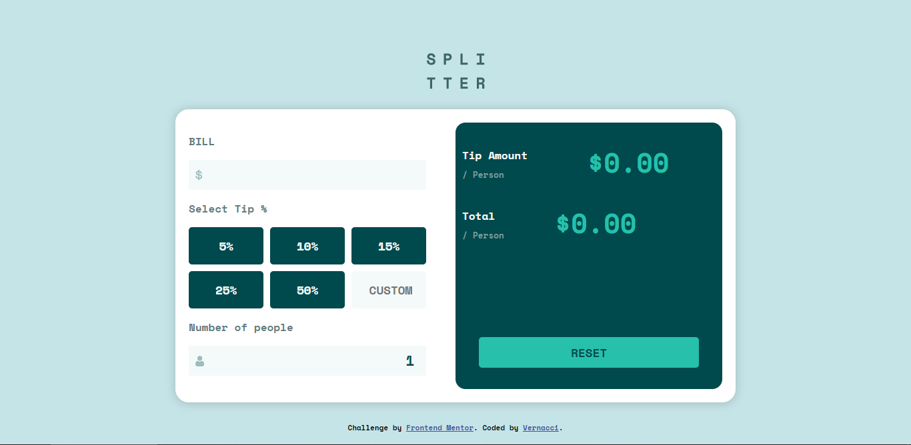

# Frontend Mentor - Tip calculator app solution

This is a solution to the [Tip calculator app challenge on Frontend Mentor](https://www.frontendmentor.io/challenges/tip-calculator-app-ugJNGbJUX). Frontend Mentor challenges help you improve your coding skills by building realistic projects.

## Table of contents

- [Overview](#overview)
  - [The challenge](#the-challenge)
  - [Screenshot](#screenshot)
  - [Links](#links)
  - [Built with](#built-with)
- [Author](#author)

## Overview

### The challenge

Users should be able to:

- View the optimal layout for the app depending on their device's screen size
- See hover states for all interactive elements on the page
- Calculate the correct tip and total cost of the bill per person

### Screenshot

### Links

- Solution URL: [Github repository](https://github.com/Vernacci/tip-calculator-app)
- Live Site URL: [Live Site](https://vernacci.github.io/tip-calculator-app/)

### Built with

- Semantic HTML5 markup
- CSS Grid
- Mobile-first workflow
- Vanilla JavaScript

## Author

- Website - [Github](https://github.com/Vernacci)
- Frontend Mentor - [@Vernacci](https://www.frontendmentor.io/profile/Vernacci)

